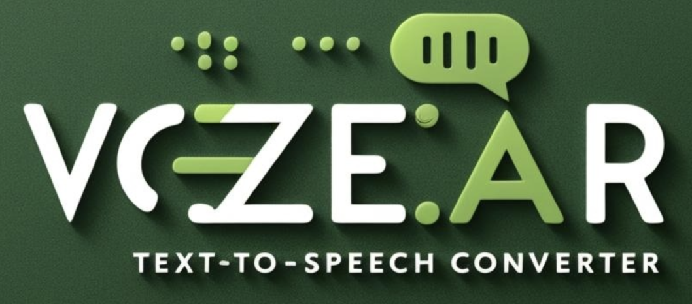

# Vozear 🎙️

<p align="center">
	
</p>

<p align="center">
	<strong>Vozear</strong> é uma aplicação web em Python e Flask que transforma texto, páginas, PDFs e imagens em áudio acessível, com apoio de IA para descrição de imagens e integração com voz natural da Microsoft.
</p>

<p align="center">
	
	
	
	
	
</p>

## ✨ Sobre o projeto

O Vozear foi criado para tornar o conteúdo digital mais acessível, especialmente para pessoas com deficiência visual. A aplicação lê textos digitados, extrai conteúdo de páginas e PDFs, descreve imagens automaticamente e gera arquivos de áudio para reprodução no navegador ou download.

O projeto também conta com uma área de comentários e painel administrativo para moderação, usando banco de dados com suporte a SQLite local e MySQL quando configurado para ambiente remoto.

## 🚀 O que o Vozear faz

- 📝 Converte texto digitado em áudio.
- 🌐 Lê o conteúdo de uma URL.
- 📄 Extrai texto de arquivos PDF.
- 🖼️ Descreve imagens com Azure Computer Vision.
- 🎤 Usa a própria voz pelo microfone para gerar texto.
- 🔊 Permite escolher vozes e ajustar a velocidade da leitura.
- ⬇️ Gera e baixa os arquivos produzidos.
- 💬 Recebe e modera comentários de usuários.

## 🧰 Tecnologias utilizadas

<p align="center">
	
	
	
	
	
	
	
	
</p>

- 🐍 Python
- 🌶️ Flask
- 🗄️ SQLAlchemy + Flask-SQLAlchemy
- 🐬 MySQL com fallback para SQLite
- 🤖 Azure Cognitive Services / Computer Vision
- 🔊 edge-tts
- 📄 PyMuPDF
- 🌍 Requests + BeautifulSoup
- 🖼️ Pillow

## ▶️ Como executar localmente

1. Crie e ative um ambiente virtual, se desejar.
2. Instale as dependências:

```bash
pip install -r requirements.txt
```

3. Configure as variáveis de ambiente, se for usar os serviços externos:

- `SECRET_KEY`
- `AZURE_CV_ENDPOINT`
- `AZURE_CV_KEY`
- `DB_HOST`, `DB_USER`, `DB_PASSWORD`, `DB_NAME`, `DB_PORT` para MySQL

4. Inicie a aplicação:

```bash
python app.py
```

A aplicação sobe, por padrão, em `http://localhost:5002`.

## ⚙️ Banco de dados

Se as variáveis de MySQL estiverem configuradas, o Vozear usa o banco remoto. Caso contrário, ele faz fallback automático para SQLite local, mantendo a aplicação funcional para desenvolvimento.

## 📌 Área administrativa

O projeto possui uma área administrativa para moderar comentários e acompanhar os registros do banco. A rota pública principal fica na página inicial e a apresentação do projeto está em `/sobre`.

## 📣 Contato

Projeto desenvolvido por Maristela Oliveira.

Se você tiver dúvidas, sugestões ou quiser contribuir, fique à vontade para abrir uma issue ou entrar em contato pelos canais do projeto.
